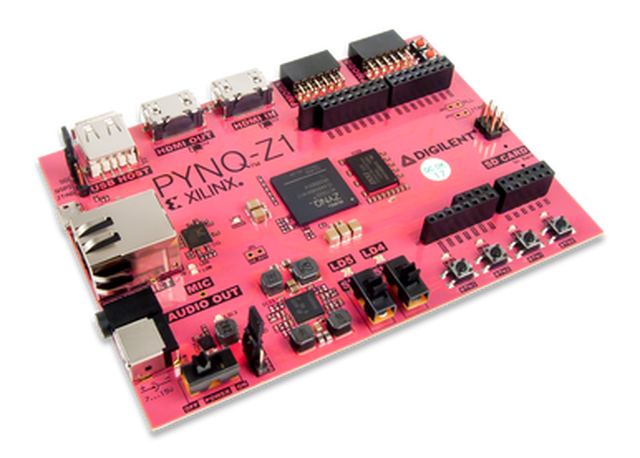

<!-------------------------------------------------------------------------------------------->
<!--Start Intro-->

  

    <h2>What is Pynq?</h2>
    

    

      
      <zero-md src="./MD/indexmd/Intro.md"></zero-md>
    

  

<!--End Intro-->
<!-------------------------------------------------------------------------------------------->
<!--Start Who Only-->

  

    <h2> Who is PYNQ for?</h2>
    

    

      <zero-md src="./MD/indexmd/Who.md"></zero-md>
    

  

<!--End Who-->
<!-------------------------------------------------------------------------------------------->
<!--Start Key Only-->

  

    <h2>Key Technologies</h2>
    

  

  

    
  

  

    

      <a class="highlight-text" href="https://jupyter.org/">Jupyter Notebook</a> 
      <zero-md src="./MD/indexmd/Key.md"></zero-md>
    

  

<!--End List of Projects-->

  

    <h2>What Software do I need</h2>
    

      <zero-md src="./MD/indexmd/What.md"></zero-md>
    

    <h2>Get Involved</h2>
    

      <zero-md src="./MD/indexmd/Get.md"></zero-md>
    

  

<!--End Text Only-->
<!-------------------------------------------------------------------------------------------->