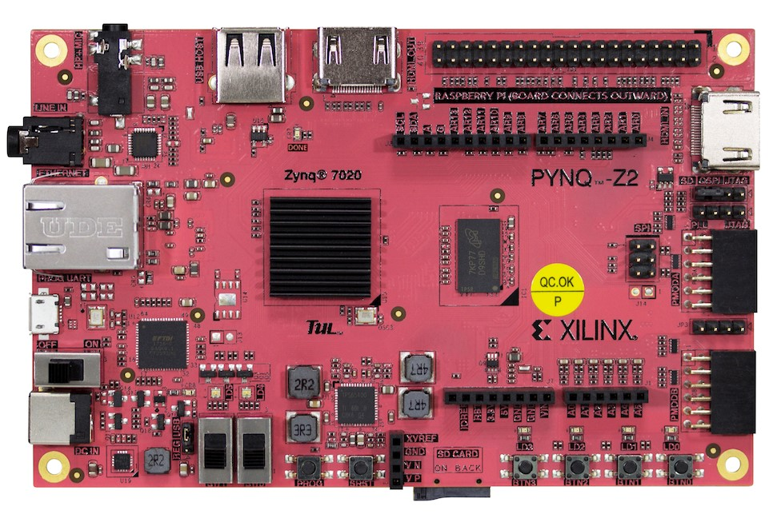

<!--Start Intro-->

  

    <h2>Recommended getting started board</h2>
    
The PYNQ-Z2 board from TUL is the recommended board for getting started with PYNQ. The PYNQ-Z2 is a low-cost Zynq 7000 development board suitable for beginner and more advanced projects. It has many features and interfaces that are useful for trying out the capabilities of the PYNQ framework. 
    

    

    

      
      <zero-md src="./MD/getstartmd/recboard.md"></zero-md>
    

  

<!--End Intro-->
