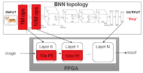

# PYNQ Alveo community projects and tutorials
PYNQ can be used with [Alveo accelerator boards](https://www.xilinx.com/products/boards-and-kits/alveo.html) and [AWS-F1](https://aws.amazon.com/ec2/instance-types/f1/). The following examples can be installed on the host computer and run on the Alveo board or on an AWS-F1 instance. 


  

    <a href="{{ item.url }}">
      
      

        <h3>{{ item.project }}</h3>
      

    </a>
  

   

     
<!-------------------------------------------------------------------------------------------->
<!--Start FINN-->

  

    <h2>Machine Learning on Xilinx FPGAs with FINN</h2>
    

    

      
      <zero-md src="./MD/communitymd/FINN.md"></zero-md>
    

  

<!--End FINN-->
<!-------------------------------------------------------------------------------------------->
